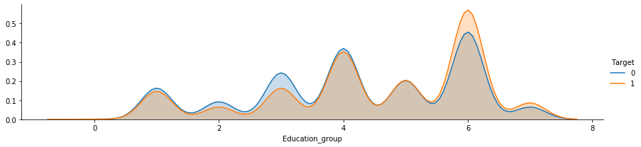

# Python-Term-deposit-prediction
The main objective of the project is to learn data analysis in python such as pandas, scikit-learn, numpy and other data handling libraries. Project also includes visualization aspects of data analysis topic.

# Technologies in use:
- Pandas
- sklearn
- matplotlib
- seaborn
- numpy
- Pickle
- Pycharm

# Problem describe
The data used in project is related with direct marketing campaign of a Portuguese banking institution. The marketing campaign were based on phone calls. Our main task is to make a prediction model to answer the question if the client has subscribed ('yes') or not ('no') a term deposit.

# Data information
Data is located in bank-full.csv and splitted into train and test data in proportion 0,9 to 0,1. As a result we have 37068 rows of training data and 4119 rows of testing data. 
# Bank client data:

**Customer-related variables:**  
1. age (numeric)  
2. job: type of job (categorical: ‘admin’, ‘blue-collar’,  ‘enterpreneur’, ‘housemaid’, management’, ‘retired’, ‘self-employed’, ‘services’, ‘student’, ‘technician’, ‘unemployed’, ‘unknown’)  
3. marital: marital status (categorical: ‘divorced’, ‘married’, ‘single’, ‘unknown’; note: ‘divorced’ means divorced or widowed)  
4. education (categorical: ‘basic.4y’, ‘basic.6y’, ‘basic.9y’, ‘high.school’, ‘illiterate’, ‘professional.course’, ‘university.degree’, ‘unknown’)  
5. default: has credit in default (categorical: ‘no’, ‘yes’, ‘unknown’)  
6. housing: has housing loan? (categorial: ‘no’, ‘yes’, ‘unknown’)  
7. loan: has personal loan? (categorial: ‘no’, ‘yes’, ‘unknown’)  

   **Last contact related variables:**   
 8.  contact: contact communication type (categorical: ‘cellular’, ‘telephone’)  
 9.  month: last contact month of the year (categorical)  
 10. day_of_week: last contact day of the week (categorical)  
 11. duration: last contact duration in seconds. Important note: this attribute highly affects the output target  

  **Other variables:**  
 12.   campaign: number of contacts performed during this campaign and for this client (numeric, includes last contact)  
 13.   pdays: number of days that passed by after the client was last contacted from previous campaign (numeric: 999 means client was not previously contacted)  
 14.   previous: number of contacts performed before this campaign and for this client  
 15.   poutcome: outcome of the previous marketing campaign (categorical: ‘failure’, ‘nonexistent’, ‘success’)  

  **Variables with socio-economic context:**  
  16. emp.var.rate: employment variation rate (numeric)  
  17. cons.price.idx: consumer price index (numeric)  
  18. cons.conf.idx: consumer confidence index (numeric)  
  19. euribor3m: euribor 3 month rate (numeric)  
  20. nr.employed: number of employees hired (numeric)  

  **Output variable (desired target):**   
    21. y - has the client subscribed a term deposit? (binary: "yes","no")

There are no missing values for each attribute.

# Feature engineering
First step in future engineering was to map categorical variables. In this step following columns were mapped into single binary variables:
- Target
- Answer
- Housing
- Loan
- Contact 

On the basis of the below listed columns, there were created binary variables (dummy variables) for each encountered unique value:
- Marital
- Education
- Job
- Month
- Day of week
- Poutcome

Based on input variables there were also made 7 additional variables:
- if_basic_educ - binary - 1 when <i>Education</i> is one of 'basic.4y', 'basic.6y', 'basic.9y' - 0 in other cases,
- if_no_loan - binary - 1 when <i>Loan</i> and <i>Housing</i> takes 0 (client doesnt have any loan), 0 in other cases,
- if_both_loan - binary - 1 when <i>Loan</i> and <i>Housing</i> takes 1 (client has both loans), 0 in other cases,
- if_holidays - binary - 1 when <i>Month</i> is 'jul' or 'aug', 0 in other cases,
- if_contact_this_camp - binary - 1 when <i>Campaign</i> > 1 (if number of contacts with client is more than one in this campaign),
- if_contact_prev - binary - 1 when <i>Pdays</i> ≠ 999 (if client has been contacted in previous campaign, 0 in other cases,
- if_contact_no_camp - binary - 1 when <i>if_contact_prev</i> is 0 and <i>Previous</i> > 0 (the client has been contacted before current and previous campaign).

# Exploratory data analysis (EDA)

## Age variable:
**Boxplot** 

**Data describe** 
| Title | Value |
| ----- | ----- |
| count | 41187.000000 |
| mean | 40.023673 years |
| std | 10.421079 years |
| min | 17 years |
| 25% | 32 years |
| 50% | 38 years |
| 75% | 47 years |
| max | 98 years |

**Density plot** 

**Density plot for age groups** 
| Age | Group label |
| --- | --- |
| < 24 | 0 |
| 25 - 54 | 1 |
| 55 - 66 | 2 |
| > 67 | 3 |

* *Groups mentioned above were created based on age groups specific to portugal.*
 

 **Conclusion:** 
Analysing above showed diagrams and data description, we can clearly see that there are many outliers (persons above 69 years old). However in my opinion there are no need replacing these records, cause looking at the density diagram, they carry valuable informations about our target variable. As we can see persons above 69 years old are more likely to accept the subscription of term deposit. Also instead having outliers in modelling, we can consider transforming age column into groups that presents specific ages. We will decide which variable suits better our problem after modelling process, based on model prediction scores. Persons between 30 and 59 years are most likely to decline term deposit subscription.

## Marital status variable:
**Categorical count plot** 

**Density plot** 
| Status | Group label |
| --- | --- |
| Married | 0 |
| Single | 1 |
| Divorced | 2 |
| Unknown | 3 |

 

**Conclusion:** 
As we see on the diagrams above, persons with marital status equal to "married" are most likely to decline the subscription offer. The difference between target values for other groups is not significant enough to speculate. In the data we also see some unknown values for marital status, we can consider removing these observations (since there are only 80) or fill values using KNN Imputer.  

## Education variable:
**Categorical count plot** 

**Density plot** 
| Education | Group label |
| --- | --- |
| Illiterate | 0 |
| Basic 4y | 1 |
| Basic 6y | 2 |
| Basic 9y | 3 |
| High school | 4 |
| Professional course | 5 |
| University degree | 6 |
| Unkown | 7 |

 

**Conclusion:** 
